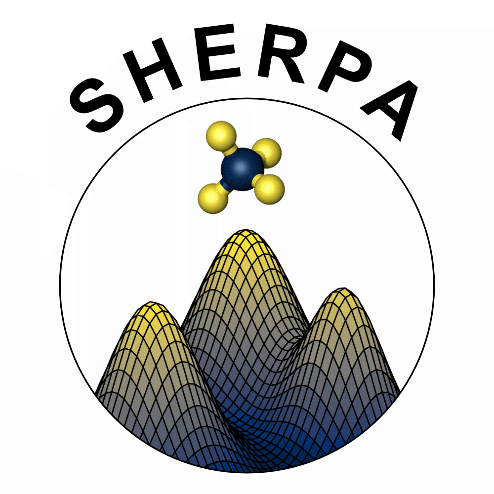

# SHERPA
**SHERPA** (**S**addle points **H**unting based on **E**nergy surface for **R**eaction **PA**thways) is the script for finding saddle points of atomic reaction with minimum-mode following methods.

We support the dimer method[[1](https://doi.org/10.1063/1.480097)], kappa-dimer method[[2](https://doi.org/10.1063/1.4898664)] and activation-relaxation technique nouveau (ARTn)[[3](http://dx.doi.org/10.1103/PhysRevE.62.7723)] as a minimum-mode following method.

SHERPA interfaces with LAMMPS (Large Atomic/Molecular Massively Parallel Simulator), VASP (Vienna Ab initio Simulation Package), and ASE (Atomic Simulation Environment) calculator.

For LAMMPS and ASE, SHERPA leverages one-sided communation through MPI library, enabling asynchronous parallel saddle point searches.

<p align="center">

</p>

## Requirement
- CMake >= 3.13
- LAPACK
- MPI

## Installation
The following executables can be installed.
- sherpa_lmp: saddle point searches script through LAMMPS C-API
- sherpa_vasp: saddle point searches script via reading/writing VASP
- sherpa_ase: saddle point searches script with embedded ASE python calculator
- extractor: script for postprocessing of outputs (see `Outputs`)
- kmc: script for kMC simulation combined with SHERPA

1. Build LAMMPS as a shared library (optional).
```bash
cd lammps
mkdir build; cd build
cmake ../cmake -D BUILD_SHARED_LIBS=yes
cmake --build . --target install
```
> [!TIP]
> Do not need to build LAMMPS, if `sherpa_lmp` is not needed.

2. Make `build` directory and configure it with `CMakeLists.txt`.
```bash
cd SHERPA
mkdir build; cd build
cmake ../
```
> [!NOTE]
> The path for the Python package for `sherpa_ase` can be specified through `CMAKE_PREFIX_PATH`.

For example, if the python interpreter is located in `/path/.conda/envs/{name}/bin/python`, `CMAKE_PREFIX_PATH` will be written as below:
```bash
cmake ../ -D CMAKE_PREFIX_PATH=/path/.conda/envs/{name}
```

3. Build and install.
```bash
# specific executable
cmake --build . --target {name of executable}
# all executables
cmake --build . --target install
```
The built executable will be copied to `SHERPA/bin`.

## Usage (sherpa)
*INPUT*, *POSCAR*, and *TARGET* are required to run the `sherpa` script.
*POSCAR* is an initial structure file written in VASP5 format, which supports `Selective dynamics`.

> [!IMPORTANT]
> `sherpa_vasp` requires additional files to run VASP such as INCAR, KPOINTS, and POTCAR. `sherpa_ase` also needs a Python file that defines the ASE calculator. An example Python file is provided as `ase_calc.py`.

Use the following commands:
```bash
# sherpa_lmp and sherpa_ase
mpirun -np ${numproc} sherpa_lmp
# sherpa_vasp
sherpa_vasp
```
where `${numproc}` stands for the number of processors.

The number of processors for VASP can be defined in `VASP_CMD` in `INPUT`.

### INPUT
#### General
* **ALGORITHM** [Dimer, kappa-dimer, art_nouveau | art_nouveau (default)]
  - *ALGORITHM* sets which algorithm to be used for saddle point search. 
* **ACTI_CUTOFF** [real | 5.0 (default)]
  - *ACTI_CUTOFF* sets the cutoff radius of active volume (in Angst).
* **ACTI_NEVERY** [integer | 3 (default)]
  - *ACTI_NEVERY* sets the interval step to expand the active volume (in Angst).
* **FINITE_DIFF** [real | 0.01 (default)]
  - *FINITE_DIFF* sets the displacement in the finite difference method (in Angst).
* **F_TOL** [real | 0.01 (default)]
  - *F_TOL* sets the force tolerance for saddle point searches and relaxation (in eV/Angst).
* **DIFF_TOL** [real | 0.4 (default)]
  - *DIFF_TOL* sets the distance tolerance for each atom in identical structures (in Angst).
* **MAX_MOVE** [real | 0.1 (default)]
  - *MAX_MOVE* sets the maximum step size of image movement (in Angst).
* **TRIAL_MOVE** [real | 0.01 (default)]
  - *TRIAL_MOVE* sets the trial step size of the image for cg optimization (in Angst).
* **MAX_SEARCH** [integer | 100 (default)]
  - *MAX_SEARCH* sets termination condition through the number of saddle point searches.
* **WRITE_TRAJ** [True/False | True (default)]
  - *WRITE_TRAJ* determines whether or not to write the saddle point search trajectories.
* **CONTINUE** [True/False | False (default)]
  - *CONTINUE* determines whether or not to continue SHERPA from previous results. *Statistics.log* and *Event.log* should be prepared.
#### Initial structure
* **NELEMENT** [integer]
  - *NELEMENT* is the number of elements
* **ATOM_TYPE** [strings]
  - *ATOM_TYPE* is the symbol of elements
* **INIT_RELAX** [True/False | True (default)]
  - *INIT_RELAX* determines whether or not to relax *INIT_CONFIG* before saddle point searches.
* **INIT_DISP** [True/False | False (default)]
  - *INIT_DISP* determines whether or not to displace structure before saddle point searches.
* **DISP_CUTOFF** [real | 5.0 (default)]
  - *DISP_CUTOFF* sets the cutoff radius, where initial displacement is defined (in Angst).
* **DISP_MOVE** [real | 0.0 (default)]
  - *DISP_MOVE* sets the magnitude of the initial displacement vector (in Angst).
* **INIT_MODE** [True/False | False (default)]
  - *INIT_MODE* determines whether or not to provide the initial eigenmode. The initial eigenmode can be provided by the file named *Initial.MODECAR*. *Initial.MODECAR* has an identical format with *SHERPA.MODECAR* (see `Outputs`) 
#### LAMMPS (only works for sherpa_lmp)
* **PAIR_STYLE** [strings]
  - *PAIR_STYLE* stands for the pair style in LAMMPS input.
* **PAIR_COEFF** [strings]
  - *PAIR_COEFF* stands for the pair coeff in LAMMPS input.
* **NCORE** [integer]
  - *NCORE* sets the number of cores for each LAMMPS instance.
#### VASP (only works for sherpa_vasp)
* **VASP_CMD** [strings]
  - *VASP_CMD* is the command to run VASP.
#### ASE (only works for sherpa_ase)
* **ASE_CALC** [strings]
  - *ASE_CALC* indicates the Python file containing the ASE calculator.
* **MODEL_PATH** [strings]
  - *MODEL_PATH* indicates the potential file for the ASE calculator.
#### Dimer (only works for dimer and kappa-dimer method)
* **F_ROT_MIN** [real | 0.1 (default)]
  - *F_ROT_MIN* sets the minimum force criteria for rotation (in eV/Angst).
* **F_ROT_MAX** [real | 1.0 (default)]
  - *F_ROT_MAX* sets the maximum force criteria for rotation (in eV/Angst).
* **MAX_NUM_ROT** [integer | 4 (default)]
  - *MAX_NUM_ROT* sets the maximum number of rotation steps in the dimer method.
* **MAX_NUM_TLS** [integer | 500 (default)]
  - *MAX_NUM_TLS* sets the maximum number of translation steps in the dimer method.
#### ART nouveau (only work for art_nouveau)
* **LAMBDA_CONV** [real | 0.01 (default)]
  - *LAMBDA_CONV* sets the convergence criteria value for Lanczos method (in eV/Angs^2).
* **MAX_NUM_ITR** [integer | 500 (default)]
  - *MAX_NUM_ITR* sets the maximum number of iterations in the ARTn method.
* **MAX_NUM_RLX** [integer | 1 (default)]
  - *MAX_NUM_RLX* sets the maximum number of perpendicular relaxation steps at an eigenvalue less than *LAMBDA_CRIT*.
* **DELAY_STEP** [integer | 0 (default)]
  - *DELAY_STEP* sets the number of initial steps without the Lanczos method.
* **MIXING_STEP** [integer | 0 (default)]
  - *MIXING_STEP* sets the number of mixing steps above inflection points. [[4](https://doi.org/10.1021/acs.jctc.0c00541)]
* **HYPER_STEP** [integer | 3 (default)]
  - *HYPER_STEP* sets the number of relaxation steps, where the relaxation trajectory is constrained on the hyperplane orthogonal to eigenmode and displacement vectors. (TBA)
#### Random
* **RANDOM_SEED** [unsigned integer | $RANDOM (default)]
  - *RANDOM_SEED* sets the seed for random number generation. A random seed is generated randomly if *RANDOM_SEED* is not specified.

> [!TIP]
> The first letter determines the applied algorithm in the case of *ALGORITHM* and boolean tags.

### TARGET
The TARGET file lists the conditions for the center atoms of the sphere. The conditions are appended sequentially and independently. Each one consists of numbers following characters. Three characters (I, T, A) and one additive (R) are supported currently. Three characters should be used once in one condition. Fixed atoms cannot be the center atoms.

* I: index (starting from 0)
* T: type (starting from 1)
* A: all
* +R: random shuffle

If the characters contain `R`, the indices of atoms are randomly shuffled.
For example,
```text
# indices of 0th, 1st, 2nd, and 3rd atoms
I 0 1 2 3
# randomly shuffled indices of type 1 atoms
TR 1
# indices of all atoms
A
```

### Outputs
#### Event.log
*Event.log* contains `{count}`, barrier energy, and frequency of unique reactions.

#### Statistics.log
*Statistics.log* shows the current progress of reaction finding. The number of unique reactions, relevant (=connected) reactions, and trials are written.

#### Redundancy.log
*Redundancy.log* tells the which reactions are duplicated.

Not all saddle points are written in all output files. The rules of the outputs are summarized in the table below.
||Unconverged|Not splited|Disconnected|Connected|
|:---|:---:|:---:|:---:|:---:|
|SHERPA.log|O|O|O|O|
|SHERPA.XDATCAR|O|O|O|O|
|SHERPA.MODECAR|X|O|O|O|
|Saddle.POSCAR|X|O|O|O|
|Final.POSCAR|X|X|X|O|

#### SHERPA.log
*SHERPA.log* contains information on saddle point searches such as steps, potential energy, and curvature.
*SHERPA.log* also provides the saddle point type, barrier energy, reaction energy, and elapsed time.

#### Time.log
*Time.log* says how long the SHERPA takes to run.

#### SHERPA.XDATCAR
*SHERPA.XDATCAR* is the trajectory of configuration during saddle point searches.

#### SHERPA.MODECAR
*SHERPA.MODECAR* is the eigenvector at the saddle point.

#### Saddle.POSCAR
*Saddle.POSCAR* is the configuration of the saddle point.

#### Final.POSCAR
*Final.POSCAR* is the configuration of the final point.

## Usage (extractor)
The below outputs have headers like `{count}_{index}`, meaning that `{count}` and `{index}` are the number of reaction finding trials and the index of the target atom, respectively.
`extractor` executable helps to extract specific `{count}` from outputs through the following command.
```bash
extractor ${output} ${count}
```
where `${output}` indicates one of the output files.

## Usage (kmc)
To run the KMC script, several settings can be provided by in-command.
```bash
kmc --sherpa_cmd "{sherpa_command}" --att_freq 1e13 --temperature 298 --kmc_step 10000 --inputs_path "./INPUTS"
```
> [!IMPORTANT]
> In *inputs_path*, input files for the `sherpa` should be located (INPUT, POSCAR, and TARGET).


### Options
* **sherpa_cmd** [string]
  - *sherpa_cmd* is the command to run SHERPA.
* **att_freq** [real | 1e13 (default)]
  - *att_freq* sets the attempt frequency of reaction rates (in Hertz).
* **temperature** [real | 298 (default)]
  - *temperature* sets the system temperature (in Kelvin).
* **kmc_step** [int | 10000 (default)]
  - *kmc_step* sets the maximum step in kMC simulation.
* **low_cut** [real | 0.1 (default)]
  - *low_cut* sets the minimum activation energy in the event table.
* **restart** [int | 0 (default)]
  - *restart* sets the initial step to continue from the previous kMC simulation.
* **inputs_path** [string | "./INPUTS" (default)]
  - *inputs_path* indicates the directory that contains input files for SHERPA.
* **random_seed** [unsigned int | $RANDOM (default)]
  - *random_seed* sets the seed for random number generation. A random seed is generated randomly if *random_seed* is not specified.
